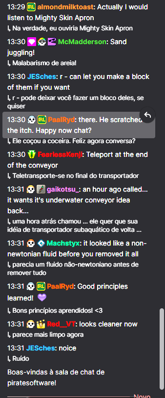

# Twitch Live Translator

Extensao Manifest V3 para Chrome e Microsoft Edge que traduz, quase em tempo real, mensagens novas do chat da Twitch. A alteracao acontece somente na visualizacao local do navegador: a Twitch nao recebe mensagem modificada e o envio de chat continua intacto.

## Estado atual

O projeto ja funciona em uso real na Twitch, mas ainda nao esta perfeito. A traducao local depende das APIs nativas do navegador e algumas frases curtas, girias, contexto de jogo e mensagens muito fragmentadas podem sair estranhas.

Este print mostra o estado atual da extensao em uma live real:



Contribuicoes sao bem-vindas, principalmente em areas que ainda precisam de refinamento:

- qualidade de traducao em mensagens curtas e com girias;
- heuristicas para detectar quando nao vale traduzir;
- suporte a mais variacoes do DOM da Twitch;
- UX do popup e feedback de download dos modelos;
- testes reais em Chrome, Edge e popout chat.

## Funcionalidades

- Detecta novas mensagens com `MutationObserver`, sem polling fixo.
- Extrai o texto da mensagem sem username, badges, timestamp e botoes.
- Preserva a estrutura original do chat, incluindo emotes, links e mencoes.
- Usa `LanguageDetector` e `Translator` nativos do navegador quando disponiveis.
- Ignora mensagens vazias, URLs isoladas, mensagens muito curtas e tokens como `GG`, `WP`, `LUL`, `KEKW` e `Pog`.
- Evita processamento repetido com `data-tlt-processed`.
- Cache LRU simples com limite de 750 traducoes.
- Fila com ate 3 traducoes simultaneas e aviso visual se houver overflow.
- Popup com idioma de destino, modos de exibicao, filtros e status das APIs.
- Botao `Preparar modelos locais` para tentar iniciar o download dos modelos a partir de um clique do usuario.
- Configuracoes persistidas com `chrome.storage.sync`.

## Modos de exibicao

1. `Original + traducao`: mostra a mensagem original e a traducao abaixo.
2. `Somente traducao`: oculta visualmente o corpo original e mostra a traducao.
3. `Traducao + original`: oculta visualmente o corpo original e mostra traducao com o texto original entre parenteses.

## Arquitetura

- `src/content/content.js`: inicializacao, observers, fluxo de processamento e integracao com storage.
- `src/content/twitchChat.js`: selectors e manipulacao segura do DOM da Twitch.
- `src/content/translationQueue.js`: controle de concorrencia e overflow.
- `src/services/translationService.js`: fachada para providers de traducao.
- `src/services/browserTranslator.js`: provider local usando `Translator` e `LanguageDetector`.
- `src/shared/constants.js`: configuracoes padrao, selectors e listas editaveis.
- `src/shared/settings.js`: leitura e escrita de configuracoes.
- `src/shared/utils.js`: logs, filtros, cache e normalizacao.
- `src/popup/*`: interface da extensao.

## Requisitos

- Chrome ou Edge Chromium em desktop.
- Manifest V3 habilitado, padrao nas versoes atuais.
- Para traducao local: navegador com suporte a `Translator API` e `Language Detector API`.

As APIs nativas sao experimentais/limitadas. A documentacao do Chrome informa que `Translator.availability()` verifica disponibilidade do par de idiomas e que o modelo pode ser baixado no primeiro uso. A MDN tambem destaca que `Translator` e `LanguageDetector` ainda nao sao Baseline e podem depender de contexto seguro, Permissions Policy e interacao recente do usuario.

Referencias:

- https://developer.chrome.com/docs/ai/translator-api
- https://developer.chrome.com/docs/ai/language-detection
- https://developer.mozilla.org/en-US/docs/Web/API/Translator_and_Language_Detector_APIs

## Instalacao manual no Chrome

1. Abra `chrome://extensions`.
2. Ative `Developer mode` no canto superior direito.
3. Clique em `Load unpacked`.
4. Selecione a pasta deste projeto: `Tradutor de chat`.
5. Abra uma pagina da Twitch com chat.

## Instalacao manual no Microsoft Edge

1. Abra `edge://extensions`.
2. Ative `Developer mode`.
3. Clique em `Load unpacked`.
4. Selecione a pasta deste projeto.
5. Abra a Twitch normalmente.

## Como testar na Twitch

1. Abra `https://www.twitch.tv/<canal>` com o chat visivel.
2. Envie ou aguarde mensagens em outro idioma.
3. Abra o popup da extensao.
4. Confirme que `Traducao automatica` esta ligada.
5. Se `Translation API` aparecer como `Disponivel, requer download`, clique em `Preparar modelos locais`.
6. Altere o idioma ou o modo de exibicao e veja a mudanca sem recarregar.
7. Teste tambem o popout em URLs como `https://www.twitch.tv/popout/<canal>/chat?popout=`.

## Download inicial dos modelos

Quando a Translator API ou a Language Detector API retorna `downloadable` ou `downloading`, o navegador pode baixar modelos locais. A extensao exibe esse estado no popup e impede criacoes duplicadas para o mesmo par de idiomas usando promises compartilhadas.

O botao `Preparar modelos locais` tenta baixar/preparar o detector de idioma e o par `en -> idioma de destino`, que cobre a maioria dos chats em ingles. Outros idiomas podem exigir download quando aparecerem pela primeira vez.

## Limitacoes conhecidas

- Se `Translator` ou `LanguageDetector` nao existirem no navegador/contexto da pagina, a extensao nao traduz e mostra o status como indisponivel.
- Algumas versoes do Chrome podem exigir flags, suporte de hardware, disponibilidade regional ou interacao recente do usuario para criar os modelos.
- Se o Chrome negar `Translator.create()` por falta de ativacao do usuario, abra o popup e clique em `Preparar modelos locais`.
- O DOM da Twitch muda com frequencia. Selectors tolerantes foram usados, mas podem precisar de ajuste.
- A opcao `Preservar emotes` existe porque essa versao nunca substitui o `innerHTML` da mensagem; ela e mantida como preferencia para evolucoes futuras.
- Sem provider externo nesta primeira versao. Nao ha API keys no projeto.

## Como alterar selectors da Twitch

Edite `src/shared/constants.js`, objeto `TLT.TWITCH_SELECTORS`.

- `chatContainer`: regioes observadas pelo `MutationObserver`.
- `message`: elementos tratados como mensagens individuais.
- `messageBody`: possiveis containers do texto da mensagem.
- `excludeFromText`: elementos removidos da copia usada apenas para extrair texto.

## Estrutura de arquivos

```text
.
|-- manifest.json
|-- README.md
|-- LICENSE
|-- docs/
|   `-- screenshots/
|       `-- translation-current-state.png
|-- icons/
|   |-- icon16.png
|   |-- icon32.png
|   |-- icon48.png
|   `-- icon128.png
`-- src/
    |-- content/
    |   |-- content.css
    |   |-- content.js
    |   |-- translationQueue.js
    |   `-- twitchChat.js
    |-- services/
    |   |-- browserTranslator.js
    |   `-- translationService.js
    |-- shared/
    |   |-- constants.js
    |   |-- settings.js
    |   `-- utils.js
    `-- popup/
        |-- popup.css
        |-- popup.html
        `-- popup.js
```
